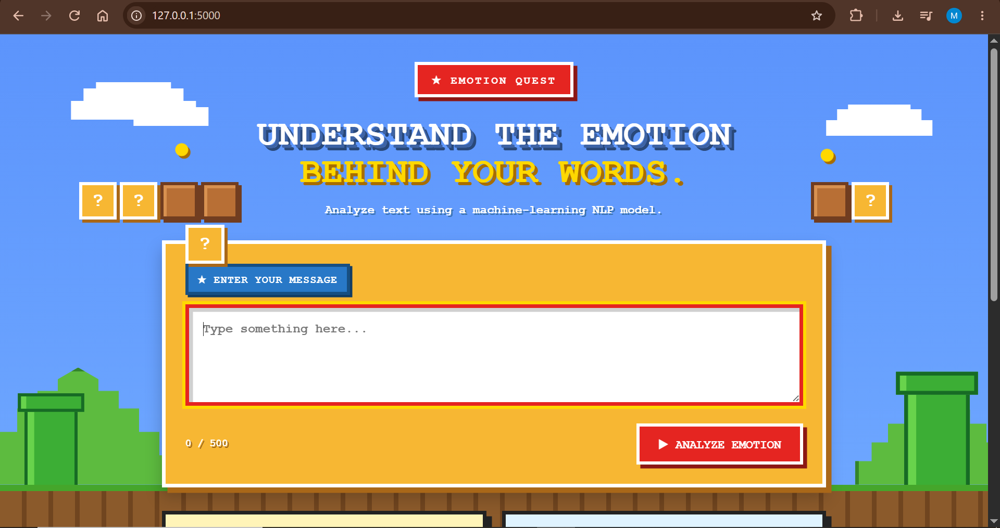
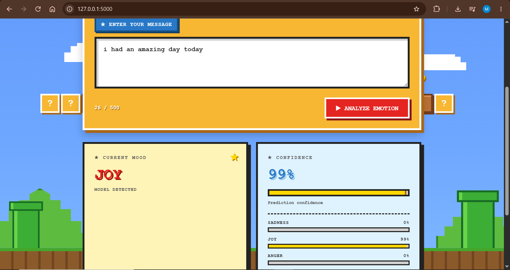

# Emotion Quest 

A full-stack emotion detection web application combining machine learning, NLP, Flask, and JavaScript.

## Demo





This project was developed across my Artificial Intelligence and Web Development coursework. I trained an emotion classification model using NLP techniques for my AI coursework, then built a web interface and Flask backend to turn the model into an interactive web application. The project received full marks for both the AI and Web Development coursework.

## Live Demo

[Try Emotion Quest](https://emotion-quest.onrender.com/)

## Features

- Detects three emotions: sadness, joy, and anger
- Uses TF-IDF and Logistic Regression
- Displays prediction confidence
- Shows probability for each emotion
- Interactive retro-style web interface
- Flask backend connected to a JavaScript frontend

## Machine Learning Results

The model achieved **96.42% accuracy on the test set**.

- Sadness F1-score: 0.96
- Joy F1-score: 0.98
- Anger F1-score: 0.93

## Technologies

- Python
- Scikit-learn
- Pandas
- NLTK
- TF-IDF
- Logistic Regression
- Flask
- JavaScript
- HTML
- CSS

## How It Works

The application follows this process:

**User Text → Flask Backend → Text Preprocessing → TF-IDF → Logistic Regression → Emotion Prediction**

The trained model and TF-IDF vectorizer are loaded by the Flask backend. When the user enters text, the application sends it to the backend, which processes the text and returns the predicted emotion, confidence, and emotion probabilities.

## Project Structure

```text
emotion-detection-web/
├── app.py
├── emotion_detection.py
├── model/
│   ├── model.pkl
│   └── vectorizer.pkl
├── static/
│   ├── script.js
│   └── style.css
├── templates/
│   └── index.html
├── README.md
└── .gitignore
